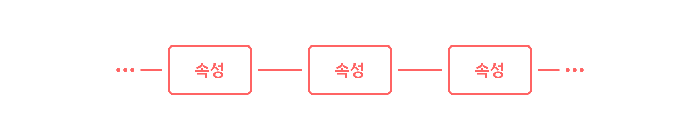
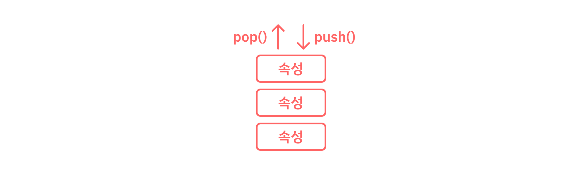
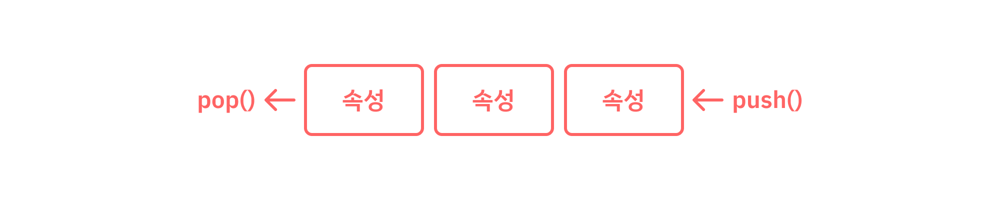

 

> CS 부수기 - 선형 자료 구조 편

 
<h3>0. 들어가며</h3>

본격적으로 기술 면접을 준비하며 Computer Science의 전반야에 대해 하나씩 정리해 나가려고 한다. 
 
그 첫번째는 선형 자료 구조(Linear Data Structure)편이다.
  
참고로 이 정리본은 내가 공부하기 위해 만들었고, 추후에도 지속적으로 보완해갈 예정이다.
 
단순히 현재 취업만을 위해 쓰일 것도 아니며, 이후에 이직을 하거나 또 다른 면접을 위해서도 사용할 예정이기에 최대한 간결하면서도 직관적으로 적어나갈 생각이다.

 
<h3>1. Linear Data Structure</h3>

자료 구조에는 크게 선형 자료 구조(Linear Data Structure)와 비선형 자료 구조(Nonlinear Data Structure)가 있다.
  
선형 자료 구조의 정의는 다음과 같다
> 선형 자료구조 : ***하나의 원소 뒤에 하나의 원소만이 존재하며, 직선 형태로 나열되어 있는 구조***

우리가 개발을 하면서 가장 대표적으로 볼 수 있는 선형 자료 구조의 형태는 **List**, **Array** 등이 있다.
  
다음 사진을 참고하면 좋다.
 

*선형 자료 구조의 이해를 돕기 위한 사진*
 
비선형 자료 구조(Nonlinear Data Structure)에 대해서는 추후에 새로운 포스팅으로 소개하곘다.

 
<h3>2. Stack & Queue</h3>

선형 자료 구조의 가장 기본이 되는 자료 구조는 스택(Stack)과 큐(Queue)이다.
  
결론부터 설명하자면 스택은 과자 프링글스를 생각하면 편하고 큐는 에버랜드를 들어가기 위해 사람들이 ~~질서정연~~하게 서있는 줄을 생각하면 된다.
  

* **Stack**
  * 의미 : 가장 마지막에 들어간 원소가 가장 먼저 나오는 자료 구조
  * 특징 : **LIFO** - Last In First Out
  * 예시 : Recursion Function (재귀 함수)
  * 시간 복잡도
    * 삽입 / 삭제의 시간 복잡도 : ***O(1)***
    * 탐색의 시간 복잡도 : ***O(n)***
  * 
  
  *스택의 이해를 돕기 위한 사진*

* **Queue**
  * 의미 : 가장 먼저 들어간 원소가 가장 먼저 나오는 자료 구조
  * 특징 : **FIFO** - First In First Out
  * 예시 : CPU 작업을 기다리는 프로세스들
  * 시간 복잡도
    * 삽입 / 삭제의 시간 복잡도 : ***O(1)***
    * 탐색의 시간 복잡도 : ***O(n)***
  * 
  
  *큐의 이해를 돕기 위한 사진*

 
이 정도로 스택과 큐는 정리가 된다.